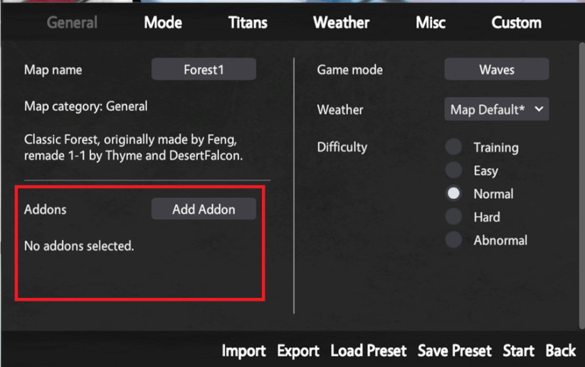
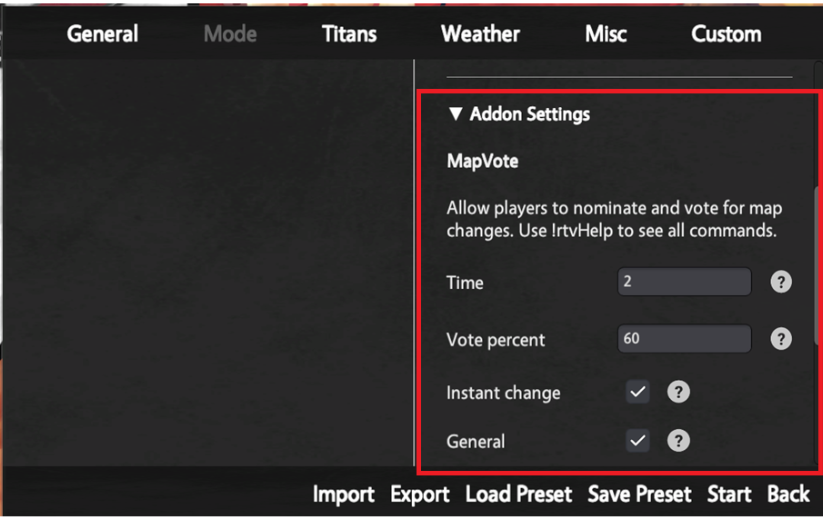

# Addons

Addons are like runtime injected components. They allow you to create general game modifiers or tools meant to be applied to a wide range of modes.

Addons are stored in a new folder in Documents/AoTTG2/Addons and are selectable in the Game-Create General panel.

<figure><figcaption></figcaption></figure>


The settings for each addon are stored under a collapsible section under Mode settings.

<figure><figcaption></figcaption></figure>

Below is an example of an addon, they operate under the same rules as components using [networkview ](/broken/pages/CI3bT8Qbvzw4BaIIHRg2) for networking to prevent cross-contamination with Main's networking logic.

```csharp
addon Test
{
    Description = "Addon description...";
    PublicVariable = 10;
    PublicVariableTooltip = "Test...";
    
    _privateTest = 10;

    function Init()
    {
        Game.Print("Init");
    }

    function OnFrame()
    {
        if (Input.GetKeyDown("Interaction/Interact"))
        {
            Game.Print("[Test] Interact pressed.");
        }
    }

    function OnChatInput(message)
    {
        self.NetworkView.SendMessageAll(message);
    }

    function OnNetworkMessage(sender, message)
    {
        Game.Print(sender.Name + " : " + message);
    }
}
```
