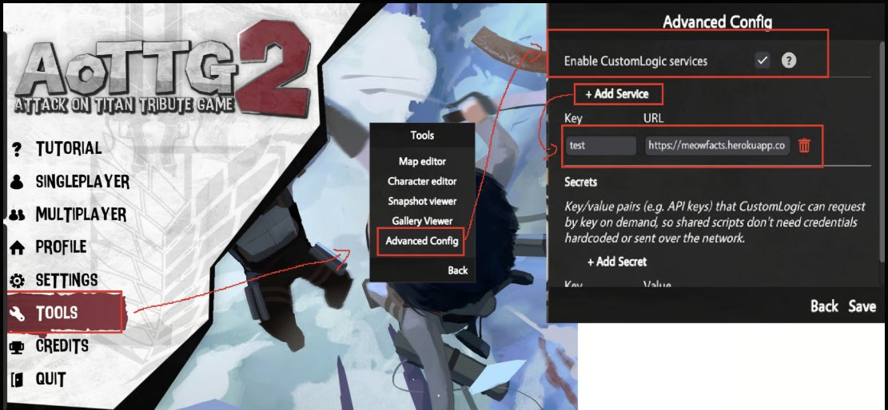

# Services

Services is a new API meant to be paired with headless mode to allow users to automate hosting without having to make a custom modded client. It's meant to expose things like database access or discord chat integration to the game through the host's client.

Please be aware that services exposed interacts with networking calls on your machine and precaution should be taken in the coding of custom logic and external services to prevent exploits. This is essentially the same issue that a custom modded client would have so as long as you know what you're doing it is fine.

Use this API at your own risk and ensure that you disable these features when not in use to prevent any issues.

## Enabling Services

Services can be enabled by going to Tools->Advanced Config and enabling the first checkbox. After that, the service you want to expose needs to be bound to a string name. This is a safety measure to prevent unregistered domains from being called from the services API.


[Service.md](../reference/Game/Service.md)


<figure><figcaption></figcaption></figure>

Additionally on this page you can register client only secrets, this ensures you can pass data to cl for masterclient only that won't be shared with other clients for things like authentication or whatever else you want to use it for.

Service API calls are gated so that only a masterclient that has manually selected and loaded the currently running script can access these fields. Unauthorized calls with throw an exception and all data is kept local to the masterclient.

## Example

Follow the steps above and set your key to test and the URL to [https://meowfacts.herokuapp.com/](https://meowfacts.herokuapp.com/) \
This is an example URL that on a simple get request with no route provided returns a fun fact about cats. You can see further documentation on the API in the reference docs.

```csharp
class Main
{
    _service = "test";
    _route = "";

    function Init()
    {
        if (Network.IsMasterClient == false)
        {
            return;
        }
        isAllowed = Service.CheckPermissions(self._service);
        Game.Print("Is Allowed: " + Convert.ToString(isAllowed));
        Service.Get(self._service, self._route, self.HandleGetRequest);
    }

    function HandleGetRequest(response, status)
    {
        Game.PrintAll(response);
        Game.PrintAll(status);
    }
}
```
